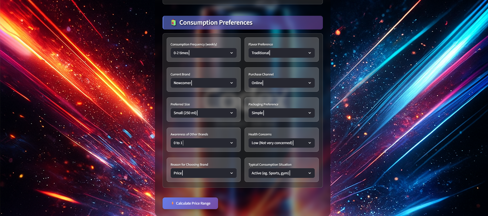

# 🥤 **Codex Energy Drink Price Prediction App**

Predict the optimal **price range** for Codex Energy Drink using consumer behavior, demographics, and brand preference data — powered by **LightGBM**, **XGBoost**, and **Random Forest**.

---

## 🚀 **Project Summary**

This project analyzes **30,000+ survey records** and predicts the **best price range** for Codex based on customer demographics, preferences, and behavioral signals.

---

# 📸 **App UI**

*(Screenshots stored in `resources/`)*




---

# 🧱 **Project Structure**

```
codex-energy-drink-price-prediction-app/
│── models/
│   ├── model.pkl
│   ├── metadata.json
│   ├── encoding_info.json
│
│── notebooks/
│   ├── EDA.ipynb
│   ├── Modeling.ipynb
│
│── resources/
│   ├── form_ui.png
│   ├── result_ui.png
│
│── app/
│   ├── main.py
│   ├── helper.py
│   ├── transformer.py
│
│── requirements.txt
│── README.md
```

---

# 🧪 **Feature Engineering Summary**

### 🔹 **1. Age Grouping**

* Converted raw age into bins:
  `18–25`, `26–35`, `36–45`, `46–55`, `56–70`.

### 🔹 **2. Text Normalization**

* Fixed typos like `"Meutreo"` → `"Metro"`.

### 🔹 **3. Logical Validations**

* Removed impossible combinations (e.g., **age > 55** cannot select **Student**).

### 🔹 **4. Ordinal Encodings**

* `age_group`
* `health_concerns`
* `preferable_consumption_size`

### 🔹 **5. Manual Encoded Columns**

* `consume_frequency_weekly_encoded`
* `awareness_of_other_brands_encoded`
* `zone_encoded`
* `income_levels_encoded`

### 🔹 **6. Derived Metrics**

**CF-AB Score**
`( consume_freq / awareness ) + consume_freq`

**ZAS Score**
`zone_encoded * income_levels_encoded`

**BSI (Brand Switching Index)**
Based on:

* not being loyal to "Established" brand
* choosing brand for Price/Quality

**Loyalty Score**
(Your logic preserved as-is)

---

# 🔥 **Final Feature List (Used by Model)**

(From `encoding_info.json`)

25 final engineered features including:

* ordinal features
* encoded columns
* derived metrics
* one-hot vectors

```
preferable_consumption_size
health_concerns
age_group
consume_frequency_weekly_encoded
awareness_of_other_brands_encoded
cf_ab_score
zone_encoded
income_levels_encoded
zas_score
bsi
loyalty_score
gender_M
occupation_Retired
occupation_Student
occupation_Working Professional
current_brand_Newcomer
reasons_for_choosing_brands_Brand Reputation
reasons_for_choosing_brands_Price
reasons_for_choosing_brands_Quality
flavor_preference_Traditional
purchase_channel_Retail Store
packaging_preference_Premium
packaging_preference_Simple
typical_consumption_situations_Casual (eg. At home)
typical_consumption_situations_Social (eg. Parties)
```

---

# 🤖 **Machine Learning Models Tested**

Only the **3 models above 90% accuracy** were kept:

| Model             | Train Acc | Test Acc   |
| ----------------- | --------- | ---------- |
| **LightGBM**      | 0.9526    | **0.9243** |
| **XGBoost**       | 0.9731    | **0.9258** |
| **Random Forest** | 0.9968    | 0.9051     |

---

# 🎯 **Why LightGBM Was Selected**

* Strong performance (~92.4% accuracy)
* Stable across hyperparameters
* Fast training
* Top 10 highest feature importances are meaningful
* XGBoost was extremely close but slightly more complex
* LightGBM generalizes better with your engineered features
* Optuna tuning gave tiny gains (~0.02–0.03), so default was kept

---

# 📊 **LightGBM Classification Report**

```
Precision  Recall  F1-Score

100-150   0.91    0.90    0.91
150-200   0.90    0.92    0.91
200-250   0.96    0.96    0.96
50-100    0.92    0.91    0.92
```

---

# ⭐ **Top Feature Importances (LightGBM)**

```
consume_frequency_weekly_encoded    1700
health_concerns                     1450
awareness_of_other_brands_encoded   1200
age_group                           1100
income_levels_encoded                950
packaging_preference_Premium         950
zas_score                            800
current_brand_Newcomer               725
zone_encoded                         700
bsi                                  650
```

---

# 🧩 **Model Metadata (metadata.json)**

```
model_type: lightgbm
python_version: 3.11
libraries:
  lightgbm 4.6.0
  sklearn 1.7.1
  pandas 2.3.2

target_classes:
  - 100-150
  - 150-200
  - 200-250
  - 50-100

ordinal_categories:
  age_group (5 bins)
  health_concerns (Low / Medium / High)
  size (Small / Medium / Large)
```

---

# 🔧 **How the Pipeline Works**

1. Input from Streamlit form
2. Data normalized + validated
3. Features encoded based on `encoding_info.json`
4. Data reordered into `final_feature_list`
5. Model predicts label (0/1/2/3)
6. Label converted back into original range:
   `["100-150", "150-200", "200-250", "50-100"]`

---

# 🖥️ **Run the App**

### Install dependencies

```
pip install -r requirements.txt
```

### Start Streamlit

```
streamlit run app/main.py
```

---

# 📦 **requirements.txt**

```
streamlit~=1.51.0
pandas~=2.3.3
numpy~=2.3.5
joblib~=1.5.2
scikit-learn~=1.7.2
lightgbm~=4.6.0
```

---

# 📜 **License**

MIT License (Open Source).

---


# Developer.
### @Javidan Akbarov - All rights reserved.

# 🎉 **Done.**